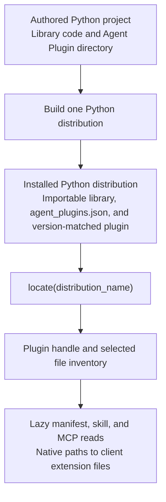

<p align="center">
  <picture>
    <source media="(prefers-color-scheme: dark)" srcset="https://raw.githubusercontent.com/peter-gy/agent-plugins/main/docs/public/brand/agent-plugins-lockup-horizontal-dark.svg">
    <source media="(prefers-color-scheme: light)" srcset="https://raw.githubusercontent.com/peter-gy/agent-plugins/main/docs/public/brand/agent-plugins-lockup-horizontal-light.svg">
    
  </picture>
</p>

<p align="center">
  Ship Agent Plugins with Python packages.
</p>

<p align="center">
  <a href="https://peter-gy.github.io/agent-plugins/"><strong>Documentation</strong></a> ·
  <a href="https://pypi.org/project/agent-plugins/"><strong>PyPI</strong></a> ·
  <a href="https://agent-plugins.org/"><strong>Agent Plugins format</strong></a>
</p>

<p align="center">
  <a href="https://pypi.org/project/agent-plugins/"></a>
  <a href="https://pypi.org/project/agent-plugins/"></a>
  <a href="https://github.com/peter-gy/agent-plugins/actions/workflows/ci.yml"></a>
  <a href="https://github.com/peter-gy/agent-plugins/blob/main/LICENSE"></a>
</p>

[Agent Plugins](https://agent-plugins.org/) gives reusable [Agent Skills](https://agentskills.io/specification) and [Model Context Protocol (MCP)](https://modelcontextprotocol.io/specification) servers one package structure that compatible clients can discover consistently. A `plugin.json` manifest identifies the format, fixed locations expose its portable components, and namespaced [client extensions](https://peter-gy.github.io/agent-plugins/integrations/client-extensions) preserve client-specific behavior. Authors maintain one plugin layout, and each client loads the parts it supports.

The specification defines that directory boundary. `agent-plugins` carries the complete plugin through Python packaging beside the library it extends. Regular Python [wheels](https://packaging.python.org/en/latest/specifications/binary-distribution-format/) and [source distributions](https://packaging.python.org/en/latest/specifications/source-distribution-format/) can contain the manifest, skills, MCP configuration, and extension files. Installing the distribution makes its matching Agent Plugin available through Python metadata. Editable installs point discovery at the authored directory.

The library and plugin share one release boundary. Teams can update library behavior, skills, MCP configuration, and client extensions together, evaluate the resulting integration against that build, then version, publish, install, and roll them back as one unit. Users and agents install one package, and compatible clients can discover the plugin for that installed library version immediately.

## Quickstart

Keep the plugin directory beside its Python package:

```text
my-project/
├── plugin.json
├── skills/
│   └── use-my-project/
│       └── SKILL.md
└── packages/
    └── python/
        ├── pyproject.toml
        └── src/
            └── my_project/
                └── __init__.py
```

Create `plugin.json`:

```json
{
  "$schema": "https://agent-plugins.org/schemas/1.0.0/plugin.schema.json",
  "name": "my-project"
}
```

Create `skills/use-my-project/SKILL.md`:

```md
---
name: use-my-project
description: Use my-project to process project records.
---

# Use my-project

Import `my_project` and call its public API.
```

Create an empty `packages/python/src/my_project/__init__.py`, then configure the Python project:

Wrap the [uv build backend](https://docs.astral.sh/uv/concepts/build-backend/) in `packages/python/pyproject.toml`:

```toml
[project]
name = "my-project"
version = "0.1.0"
requires-python = ">=3.10"

[build-system]
requires = ["agent-plugins", "uv_build"]
build-backend = "agent_plugins.build.uv_build"

[tool.agent-plugins]
root = "../.."
```

With the [uv package manager](https://docs.astral.sh/uv/) installed, preview the selected files, build the package, install the wheel in a temporary environment, and locate its Agent Plugin:

```console
uv run --with agent-plugins agent-plugins plan packages/python
uv build packages/python --out-dir dist
uv run \
  --with agent-plugins \
  --with dist/my_project-0.1.0-py3-none-any.whl \
  agent-plugins locate my-project
```

```text
/path/to/site-packages/my_project-0.1.0.agent-plugin
```

The printed Agent Plugin directory and the importable library came from the same wheel and share its distribution version.

The [complete quickstart](https://peter-gy.github.io/agent-plugins/guide/getting-started) includes the Python package and Agent Skill files needed for a runnable project.

## Inspect installed plugins

Add `agent-plugins` to runtime dependencies when Python code calls the inspection API:

```toml
[project]
dependencies = ["agent-plugins"]
```

```python
import agent_plugins as ap

plugin = ap.locate("my-project")

print(plugin.manifest.name)
print(plugin.tree())

for skill in plugin.skills:
    print(skill.tree(max_depth=2))
    print(skill.body)

if plugin.mcp is not None:
    for name, server in plugin.mcp.servers.items():
        print(name, server)
```

`locate()` accepts the Python distribution name used by `pip`. `plugin.manifest.name` is a separate Agent Plugin identity.

Code-mode agents that can execute Python can use the installed distribution as their plugin source. Through the same API, they can inspect the manifest and MCP configuration, traverse `plugin.skills`, read skill instructions, and open client extension files through native `Path` operations. See [Inspect installed plugins](https://peter-gy.github.io/agent-plugins/guide/inspect-installed).

## Core model



The build plan selects the plugin files and checks their paths before the backend packages them beside the library. Manifest, MCP, and skill-document content is read on first access through the inspection API and cached for that handle.

## Related work

[TanStack Intent](https://tanstack.com/intent/) versions Agent Skills with npm library releases and lets agents discover them from installed dependencies. `agent-plugins` applies that package-manager principle to Python and carries the broader Agent Plugins format: the manifest, optional skills and MCP configuration, and client extension files.

## Development

[`development_docs/`](https://github.com/peter-gy/agent-plugins/tree/main/development_docs) covers contributor setup, architecture, testing, packaging, documentation, and releases. Serve the docs through [Portless](https://portless.sh/):

```console
pnpm --dir docs dev
```

The main checkout uses `https://docs.agent-plugins.localhost`. Linked worktrees receive a branch-prefixed subdomain.

## License

Licensed under the [Apache License 2.0](https://github.com/peter-gy/agent-plugins/blob/main/LICENSE).
