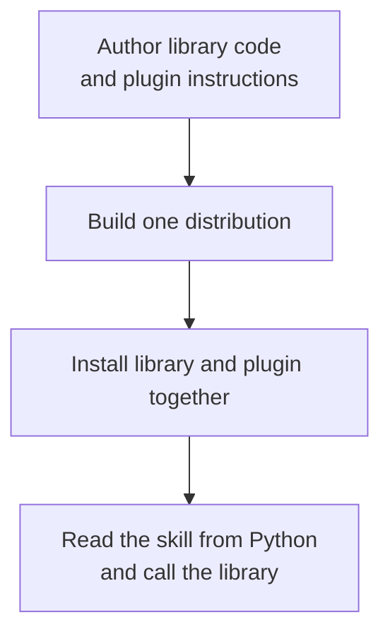

# What is an Agent Plugin?

An [Agent Plugin](https://agent-plugins.org/) is a directory with a `plugin.json` manifest and optional components. [Agent Skills](https://agentskills.io/specification) provide instructions and resources. [Model Context Protocol (MCP)](https://modelcontextprotocol.io/specification) server declarations describe connections to tools and services. Namespaced [client extensions](/integrations/client-extensions) hold client-specific data and files.

`agent-plugins` packages that directory with a Python library. An agent that can execute Python can read the library's packaged instructions, then compose calls to its API for a task. The same workflow applies to a short script, an interactive session, or a notebook.

With `agent-plugins` [installed](/guide/inspect-installed), read its own packaged skill:

```python
import agent_plugins as ap

plugin = ap.locate("agent-plugins")
print(plugin.skill("agent-plugins").source)
```

An **agent client** is the application hosting the model and its execution tools. It decides which instructions to load and which components to activate. The Python API supplies files, text, validated configuration, and subprocess inputs for that integration.

## One release boundary

The built distribution captures the library code and selected Agent Plugin files from the same source revision. Run library tests and evaluate the plugin against that build, then publish one distribution version. Installing another version replaces both packaged surfaces together.

A [wheel](https://packaging.python.org/en/latest/specifications/binary-distribution-format/) is the installable archive carrying both code and plugin. A [source distribution](https://packaging.python.org/en/latest/specifications/source-distribution-format/) carries the source for rebuilding that wheel. An editable installation points discovery at the authored plugin directory.

## The lifecycle

<div class="diagram-lifecycle">



</div>

The **authored plugin directory** is the directory you maintain. Its root contains `plugin.json`.

The **build plan** is an ordered set of source-to-target file mappings. `agent-plugins plan` shows this selection before a build.

A **Plugin handle** is the filesystem-backed Python object returned by `agent_plugins.locate()`, selected from a project with `Plugin.from_project()`, or created from a complete directory tree with `Plugin(path)`.

## Plugin contents

A plugin directory has one required file and three optional content surfaces.

| Content | Role | Selection |
| --- | --- | --- |
| `plugin.json` | Identifies the Agent Plugin and its schema | Always required |
| `skills/` | Contains immediate Agent Skill directories | Complete directory tree |
| `mcp.json` | Describes MCP server entries | Included when present |
| Client extension files | Supplies files owned by a specific agent client | Selected with `include` patterns |

`plugin.json.extensions` is **manifest extension data**. It is namespaced JSON inside the manifest. Client extension files are separate files in the plugin directory.

## Identities and versions

<table class="identity-table">
  <thead><tr><th>Term</th><th>Source</th><th>Used by</th></tr></thead>
  <tbody>
    <tr><td>Python distribution name</td><td><code>project.name</code> in <code>pyproject.toml</code></td><td><code>pip</code>, <code>locate()</code>, and <code>installed()</code></td></tr>
    <tr><td>Plugin name</td><td><code>name</code> in <code>plugin.json</code></td><td>Agent Plugin manifest consumers</td></tr>
    <tr><td>Distribution version</td><td><code>project.version</code></td><td>Wheel metadata and installed paths</td></tr>
    <tr><td>Plugin version</td><td>Optional <code>version</code> in <code>plugin.json</code></td><td>Agent Plugin consumers</td></tr>
    <tr><td>Format version</td><td><code>$schema</code> in each JSON document</td><td>Document validation</td></tr>
  </tbody>
</table>

`locate()` accepts the Python distribution name. The library does not require the distribution name, plugin name, distribution version, and plugin version to match.

## Related work

[TanStack Intent](https://tanstack.com/intent/) versions Agent Skills with npm library releases and discovers them from installed dependencies. `agent-plugins` applies that package-manager pattern to Python and uses the broader Agent Plugins directory as its artifact, including the manifest, optional skills and MCP configuration, and client extension files.

## What the library owns

`agent-plugins` owns file selection, artifact augmentation, project and installed discovery, filesystem handles, local document validation, and transport-neutral stdio launch resolution.

The agent client owns installation policy, permission prompts, plugin data retention, MCP process startup, transport connections, and user experience. `resolve_stdio()` expands Agent Plugins placeholders and resolves local subprocess inputs. It does not prove that the executable can start or that an endpoint is available.

Document and path validation proves supported structure and containment. Review packaged instructions and executables before installation or activation. Validation does not establish that their behavior is trustworthy.

Continue with [Get started](/guide/getting-started) to package and locate one Agent Plugin.
