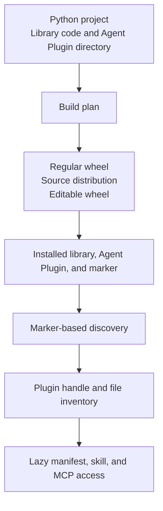

# What is an Agent Plugin?

An Agent Skill teaches an agent how to use a library. When the library and skill follow separate installation paths, their versions can diverge. `agent-plugins` puts them in one Python distribution, so installing or rolling back that distribution moves the code and instructions together.

An **agent client** is an application that loads agent instructions and integrations. An [Agent Plugin](https://agent-plugins.org/) is a portable directory that groups those files for one software project. The directory can contain [Agent Skills](https://agentskills.io/specification), [Model Context Protocol (MCP)](https://modelcontextprotocol.io/specification) server configuration, and [client extension files](/integrations/client-extensions).

`agent-plugins` carries that directory through Python packaging. A regular wheel installs the plugin contents beside the Python distribution metadata. An editable wheel points discovery at the authored plugin directory. The Python API and command-line interface (CLI) locate either form through the installed distribution metadata.

A [wheel](https://packaging.python.org/en/latest/specifications/binary-distribution-format/) is an installable Python archive. A [source distribution](https://packaging.python.org/en/latest/specifications/source-distribution-format/) carries source files for a build frontend to turn into a wheel.

## One release boundary

The built distribution captures the library code and selected Agent Plugin files from the same source revision. Run library tests and evaluate the skill against that build, then publish one distribution version. Installing another version replaces both packaged surfaces together.

For users and agents, install the Python distribution once. The Agent Plugin is immediately available for compatible clients to discover. A code-mode agent can call `agent_plugins.locate()` and read the same packaged `SKILL.md`, references, scripts, and assets through native Python paths.

## The lifecycle

The **authored plugin directory** is the directory you maintain. Its root contains `plugin.json`.

The **build plan** is an ordered set of source-to-target file mappings. `agent-plugins plan` shows this selection before a build.

The **`agent_plugins.json` marker** lives inside the Python distribution metadata. It records the installed plugin root and exact file inventory.

A **Plugin handle** is the filesystem-backed Python object returned by `agent_plugins.locate()` or created directly with `agent_plugins.Plugin(path)`.

## Plugin contents

A plugin directory has one required file and three optional content surfaces.

| Content | Role | Selection |
| --- | --- | --- |
| `plugin.json` | Identifies the Agent Plugin and its schema | Always required |
| `skills/` | Contains immediate Agent Skill directories | Complete directory tree |
| `mcp.json` | Describes MCP server entries | Included when present |
| Client extension files | Supplies files owned by a specific agent client | Selected with `include` patterns |

`plugin.json.extensions` is **manifest extension data**. It is namespaced JSON inside the manifest. Client extension files are separate files in the plugin directory.

## Identities and versions

Several names and versions coexist by design.

<table class="identity-table">
  <thead><tr><th>Term</th><th>Source</th><th>Used by</th></tr></thead>
  <tbody>
    <tr><td>Python distribution name</td><td><code>project.name</code> in <code>pyproject.toml</code></td><td><code>pip</code>, <code>locate()</code>, and <code>installed()</code></td></tr>
    <tr><td>Plugin name</td><td><code>name</code> in <code>plugin.json</code></td><td>Agent Plugin manifest consumers</td></tr>
    <tr><td>Distribution version</td><td><code>project.version</code></td><td>Wheel metadata and installed paths</td></tr>
    <tr><td>Plugin version</td><td>Optional <code>version</code> in <code>plugin.json</code></td><td>Agent Plugin consumers</td></tr>
    <tr><td>Format version</td><td><code>$schema</code> in each JSON document</td><td>Document validation</td></tr>
  </tbody>
</table>

`locate()` accepts the Python distribution name. The library does not require the distribution name, plugin name, distribution version, and plugin version to match.

## What the library owns

`agent-plugins` owns file selection, artifact augmentation, installed discovery, filesystem handles, and local document validation.

The agent client owns installation policy, permission prompts, placeholder expansion, MCP process startup, transport connections, and user experience. An accepted MCP server entry describes a configuration. It does not prove that the server executable or endpoint is available.

Document and path validation proves supported structure and containment. Review packaged instructions and executables before installation or activation. Validation does not establish that their behavior is trustworthy.

Continue with [Get started](/guide/getting-started) to package and locate one Agent Plugin.
