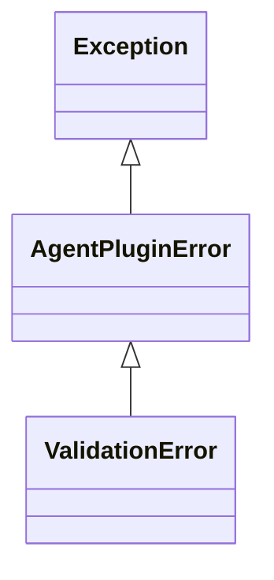

# Errors and issues

`agent-plugins` distinguishes operational failures, fatal document failures, and recoverable document issues.

## Error hierarchy

<div class="diagram-compact">



</div>

`AgentPluginError` covers missing distributions, markers, roots, required files, unsafe selected paths, build-plan failures, and archive failures.

`ValidationError` covers fatal JSON, schema, manifest, MCP, and skill-document failures. It exposes:

- `path: Path`, the affected document.
- `issues: tuple[ValidationIssue, ...]`, the fatal issues.

Its message renders the first issue with a location such as `$.name` or `$.mcpServers.records`.

## `ValidationIssue`

```python
@dataclass(frozen=True, slots=True)
class ValidationIssue:
    location: tuple[str | int, ...]
    message: str
```

Locations are path components. String components name object fields and integer components identify array indexes.

## Recoverable issues

Successful access can still return issues:

```python
manifest = plugin.manifest
print(manifest.name)

for issue in manifest.issues:
    print(issue.location, issue.message)
```

Manifest issues describe ignored unknown top-level fields and an ignored malformed top-level `extensions` value.

MCP issues describe invalid server entries skipped while valid siblings were retained.

## Catch failures

Catch `ValidationError` when the document path and issue collection affect recovery. Catch `AgentPluginError` for the complete package boundary.

```python
import agent_plugins as ap

try:
    plugin = ap.locate("my-project")
    name = plugin.manifest.name
except ap.ValidationError as error:
    print(error.path)
    for issue in error.issues:
        print(issue.location, issue.message)
except ap.AgentPluginError as error:
    print(error)
```

`Plugin.tree()` and `Skill.tree()` raise `ValueError` for negative bounds. This error is outside the `AgentPluginError` hierarchy.
